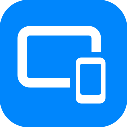
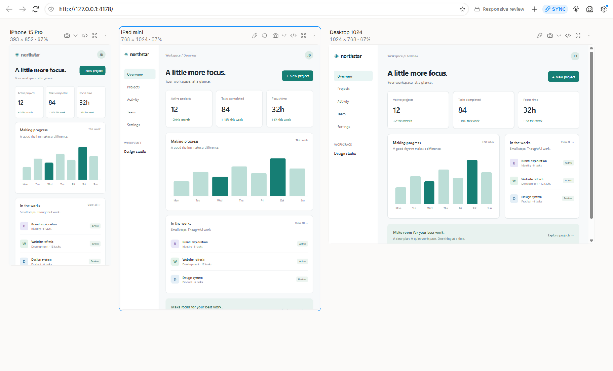
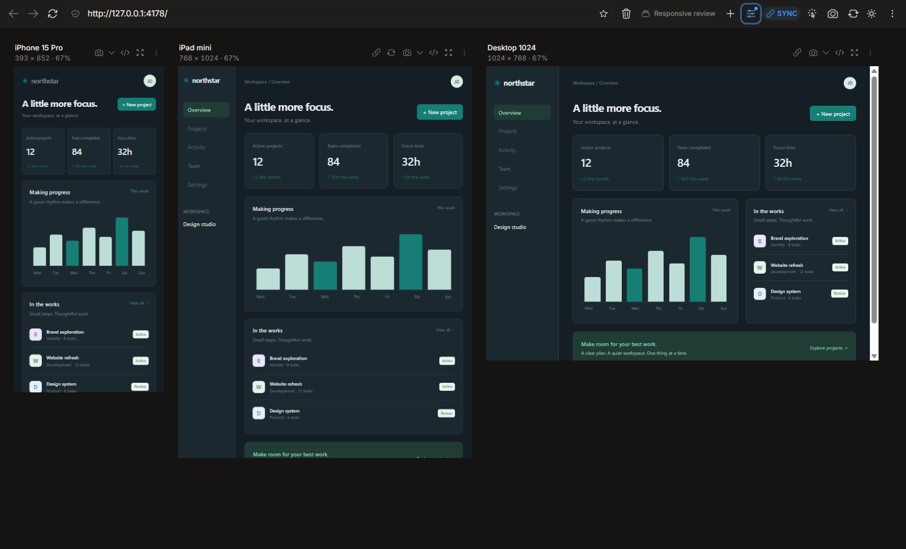
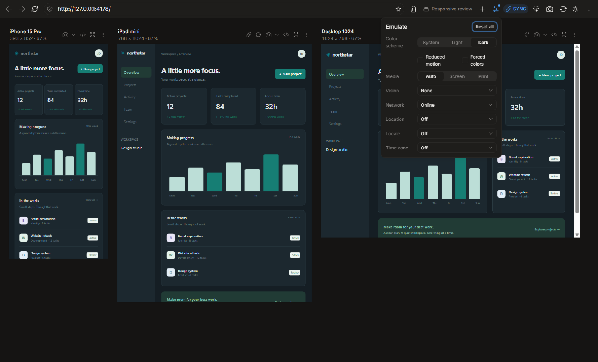
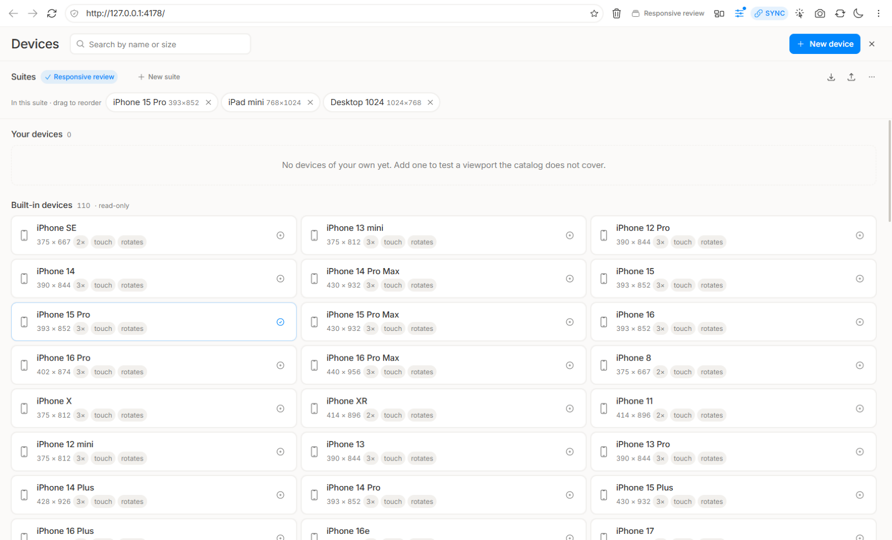
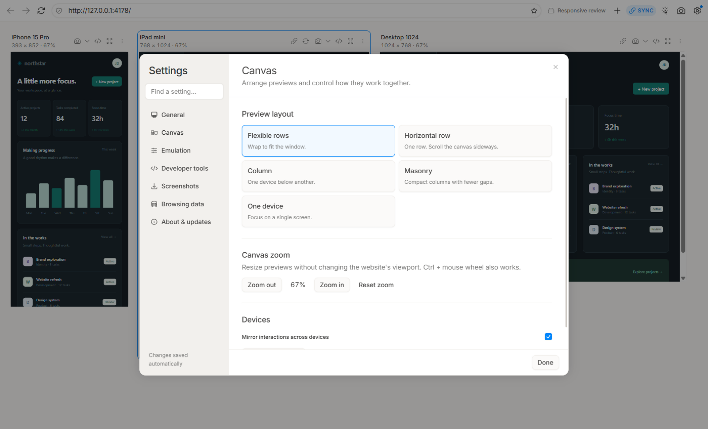
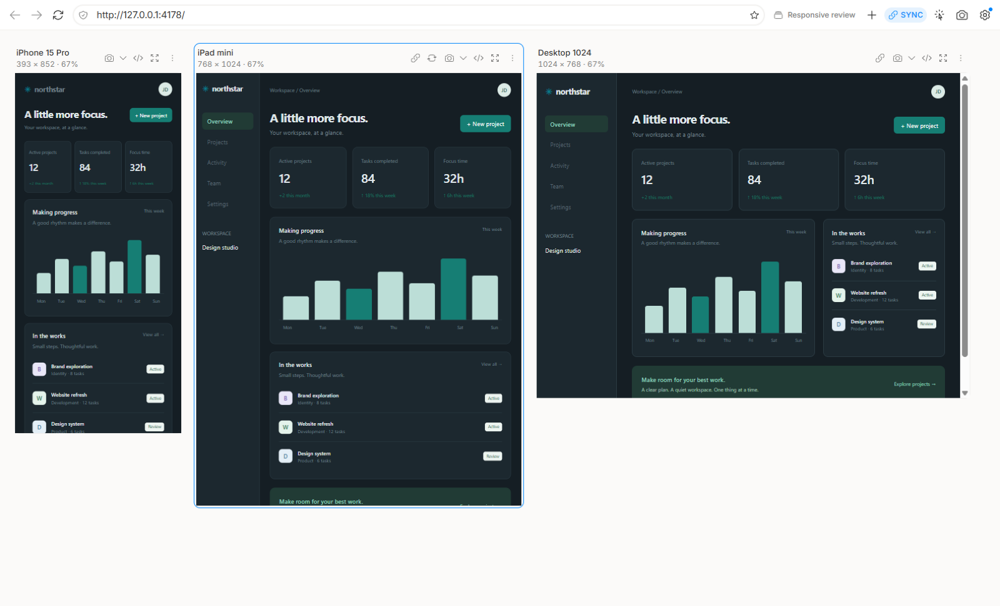

<p align="center"></p>
<h1 align="center">Respo</h1>
<p align="center"><strong>One page. Every screen. A clearer way to build responsive websites.</strong></p>
<p align="center">A free, open-source desktop browser with synchronized device previews,<br>Chromium emulation, per-device DevTools and tools for checking the details.</p>
<p align="center">
  <a href="https://github.com/prodbyEDDY/respo/releases/latest"></a>
  <a href="LICENSE"></a>
  <a href="https://github.com/prodbyEDDY/respo/actions/workflows/ci.yml"></a>
  
</p>
<p align="center"><a href="https://github.com/prodbyEDDY/respo/releases/latest"><strong>Download for Windows</strong></a> · <a href="#quick-start">Quick start</a> · <a href="#what-you-can-do">Features</a> · <a href="#development">Development</a></p>



<p align="center"><sub>Real Respo screenshots. Northstar is the included fictional responsive demo, shown at 67% canvas zoom.</sub></p>

## Install

**Windows 10/11, x64.** Download [Respo-Setup-0.1.2.exe](https://github.com/prodbyEDDY/respo/releases/download/v0.1.2/Respo-Setup-0.1.2.exe), or install the latest release from PowerShell:

```powershell
irm https://raw.githubusercontent.com/prodbyEDDY/respo/main/scripts/install.ps1 | iex
```

Installs for your user without administrator access. Respo checks for updates daily; the **Update** chip lets you download and restart into the next version.

**Unsigned release:** Respo does not yet have a code-signing certificate. Windows may show an “Unknown publisher” or SmartScreen warning when you download or run the installer. This is expected for an unsigned app; the warning alone does not mean malware was detected. Download from this repository's [official releases](https://github.com/prodbyEDDY/respo/releases/latest). See [Microsoft's explanation of SmartScreen reputation](https://learn.microsoft.com/en-us/windows/apps/package-and-deploy/smartscreen-reputation).

macOS and Linux installers are not available yet.

## Privacy

**No telemetry, usage analytics or automatic crash-report uploads.** Respo stores settings, device suites, bookmarks, browsing history and diagnostic logs locally. Screenshots are saved to the folder you choose. Respo does not upload this data to the developer or a cloud service.

Website previews connect directly to the sites you open, just like a browser; those sites may have their own analytics and data collection. Update checks and downloads connect to GitHub and its release infrastructure, which receive normal network request information such as your IP address. Automatic update checks can be disabled in **Settings → About & updates**; downloads only start when you choose to update.

## Quick start

1. Paste a website URL, or press **Ctrl+O** to open a local HTML file.
2. Pick a device suite. Scroll, click or type in a preview; the other devices follow.
3. Open **Settings → Emulation** to check color schemes, network conditions and more. Use a device's **DevTools** button to inspect it, or **Ctrl+S** to capture every device.

Use the device menu for rotation, screenshots, guides and other per-device actions. The settings button opens a searchable window with General, Canvas, Emulation, Developer tools, Screenshots, Browsing data and About & updates. On smaller windows, a section picker replaces the sidebar.

## What you can do

| Your task                   | Respo tools                                                                                                                                                                      |
| --------------------------- | -------------------------------------------------------------------------------------------------------------------------------------------------------------------------------- |
| Check responsive layouts    | 110 device presets grouped into phones, tablets, laptops and desktops. Custom devices, named suites, rotation and 25–200% canvas zoom. Five layouts, including a horizontal row. |
| Work across screens         | Synchronized navigation, scrolling, clicks and typing. Mute an individual device or pause mirroring globally.                                                                    |
| Inspect a problem           | DevTools for each device, console-error indicators, overflow detection and an element picker. Dock below, to the right, or in a separate window.                                 |
| Test different environments | Color scheme, reduced motion, forced colors, print, six vision simulations, network throttling, geolocation, locale and time zone.                                               |
| Check the visual details    | Rulers, draggable guides, design-image overlays, CSS outlines and full-page or viewport screenshots.                                                                             |
| Keep a workspace ready      | Bookmarks, history, portable suite import/export, local-file live reload, site permissions and persisted settings.                                                               |

Device emulation uses Chromium's DevTools Protocol, including viewport, pixel ratio, touch, user agent and Client Hints. It remains Chromium: an iPhone preset does not run Safari's rendering engine.

<details>
<summary><strong>Dark theme</strong></summary>



</details>
<details>
<summary><strong>Emulation controls</strong></summary>



</details>
<details>
<summary><strong>Devices and suites</strong></summary>



</details>

<details>
<summary><strong>Settings and horizontal layout</strong></summary>





</details>

## New in 0.1.2

- One settings window with seven organized sections, search and a compact layout for smaller screens.
- A collapsible device library with category counts, search across all categories and expandable lists.
- Horizontal canvas layout: previews in one row, with sideways scrolling using the mouse wheel over the canvas.
- Versioned Windows shortcut icons, so updates refresh the monogram without clearing the system icon cache.

## New in 0.1.1

- Menus, nested selections, tooltips and dialogs display above native previews and docked DevTools. Live views return when the floating UI closes.
- Thin themed scrollbars, consistent icon sizes, compact device headers and correctly applied typography tokens.
- Scrollable dialogs and panels that fit smaller windows, clearer keyboard focus and reduced-motion support.
- A new **R monogram**, refreshed screenshots and a reproducible screenshot demo.

See [CHANGELOG.md](CHANGELOG.md) for release details. The [three icon concepts](docs/assets/icon-options.svg) and their [SVG sources](docs/design/icons) are included; the monogram is the selected application icon.

## Keyboard shortcuts

| Shortcut                               | Action                                           |
| -------------------------------------- | ------------------------------------------------ |
| `Ctrl+L` / `Ctrl+D` / `Ctrl+O`         | Address bar / bookmark / open a local file       |
| `Ctrl+R` / `Ctrl+Shift+R`              | Reload all / reload ignoring cache               |
| `Ctrl+I` / `Esc`                       | Inspect an element / stop inspecting             |
| `Ctrl+S` / `Ctrl+Alt+S`                | Screenshot every viewport / full pages           |
| `Ctrl+Shift+L` / `Esc`                 | Cycle layouts / leave one-device mode            |
| `Alt+R`                                | Toggle rulers                                    |
| `Ctrl+Alt+Q` / `A` / `Z` / `Backspace` | Clear site storage / cookies / cache / all three |
| `Ctrl` + mouse wheel                   | Zoom the canvas                                  |

Letter shortcuts also recognize Cyrillic keyboard layouts.

## Coming next

Native application menus, deep links, a command palette and first-run guidance are planned for the 0.1 series. **MCP support for AI agents is planned for 0.2; it is not part of this release.** macOS support and a unified console are later work.

## Development

```bash
npm ci             # Node 20.19+; installs Electron
npm run dev
npm run typecheck
npm run lint
npm test
npm run e2e        # Playwright drives the real Electron app
npm run build:win  # Windows NSIS installer in dist/
```

To refresh the README captures on Windows, build the app and run `node scripts/screenshots.mjs`. It uses a separate temporary profile and serves [the demo](docs/assets/demo.html) on loopback port 4178. `node scripts/icon-options.mjs && npm run icons` regenerates the icon assets.

Electron · WebContentsView · React · TypeScript · Zustand · shadcn/ui · Tailwind. See [CONTRIBUTING.md](CONTRIBUTING.md) and the [architecture documentation](docs/README.md) (Russian).

## License

[MIT](LICENSE). Third-party licenses and attribution are in [NOTICE.md](NOTICE.md). No code or device data from Responsively App is used.
